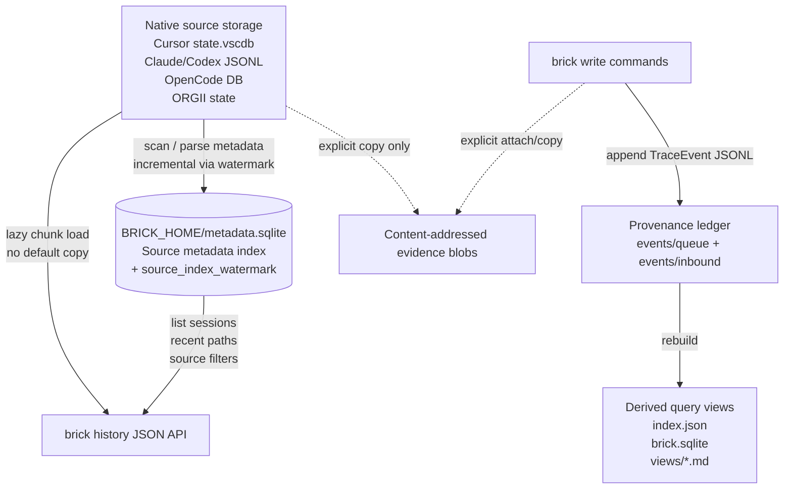
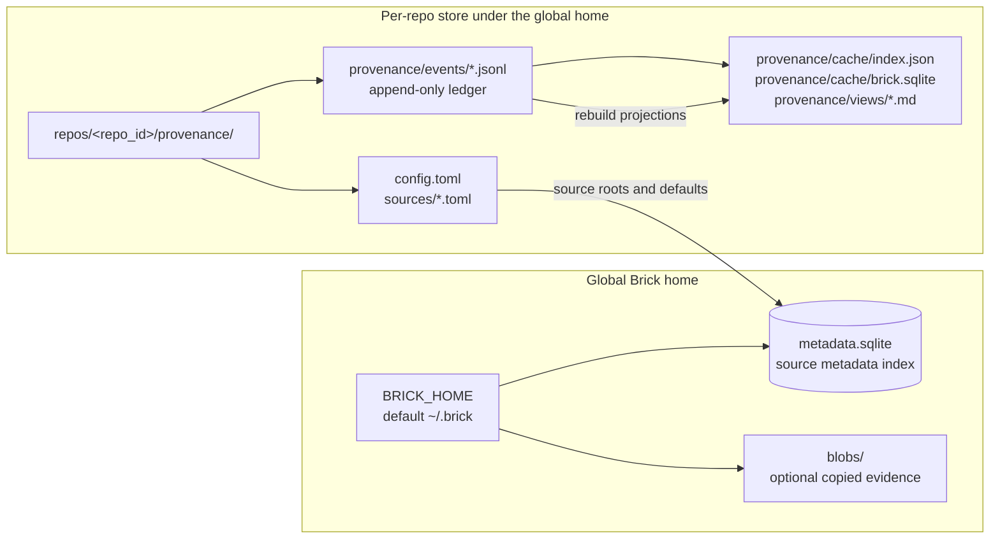
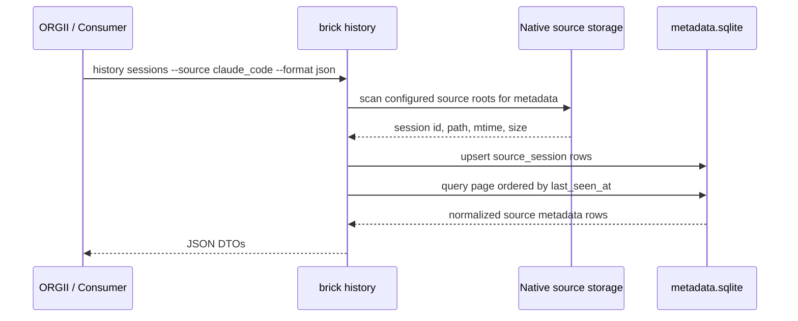
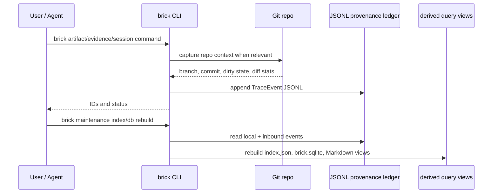
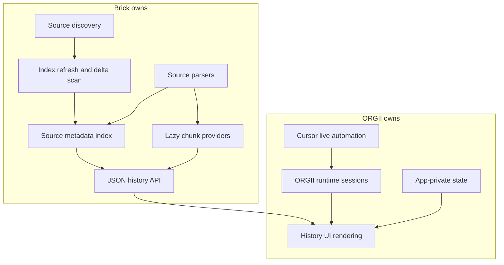

# Brick Architecture

This document defines the current Brick storage and history architecture. The naming rule is intentional: `metadata.sqlite` is the **source metadata index**, not a second cache layer and not a transcript store.

## Naming glossary

| Term | Meaning | Durable? | Rebuildable? |
| --- | --- | --- | --- |
| Native source storage | The original storage owned by Cursor, Claude Code, Codex, OpenCode, ORGII, or another source app. | Yes, outside Brick | No |
| Source metadata index | Brick's normalized metadata rows for external sessions, roots, paths, fingerprints, parser versions, and links. Stored in `<BRICK_HOME>/metadata.sqlite`. | Yes as Brick local metadata | Yes from native sources where available |
| Provenance ledger | Brick's append-only accountability events. Stored as JSONL events. | Yes | No |
| Derived query views | `index.json`, `brick.sqlite`, and Markdown `views/` rebuilt from the provenance ledger. | No | Yes |
| Evidence blobs | Optional copied full transcript/log/attachment bytes in content-addressed storage. | Yes when explicitly copied | No |

Avoid using “cache” for `metadata.sqlite` in product architecture. Use “metadata index” or “source metadata index”. “Cache” is still acceptable for repo-local derived query files such as `index.json` and `brick.sqlite`, because those are disposable projections of the provenance ledger.

## Source-of-truth boundaries

Key points:

- Native source storage remains the raw transcript/source-of-truth for external app history.
- `metadata.sqlite` stores normalized source metadata, not full transcripts by default.
- Brick JSONL events are the durable provenance claims.
- Derived query views can be deleted and rebuilt from Brick JSONL events.
- Evidence blobs exist only when the user explicitly copies/uploads full content.

## Local storage layout

Storage is zero-config and fully under the global Brick home: there is no `brick init` and nothing is written into the working tree. Each repository's provenance ledger and derived caches live under `<BRICK_HOME>/repos/<repo_id>/provenance/`, where `repo_id` is derived from the repository's canonical root path. Source profiles are optional — when none are configured, sources are auto-discovered on demand.

## History read path

`history sessions` and `history recent-paths` are read-through operations: they refresh metadata from configured native roots, then query `metadata.sqlite`. Refresh is **incremental**. A per-source high-water mark lives in the `source_index_watermark` table (`source_id`, `last_indexed_updated_at`, `last_refreshed_at`), and `list_source_sessions_since(profile, limit, since)` is the incremental entry point. Each provider skips work it has already indexed:

- **codex, claude_code, gemini** (JSONL/JSON): a file-mtime skip gate in the native file walker skips parsing any session file whose mtime is at or below the watermark, avoiding full re-scans of large histories.
- **ORGII, OpenCode**: SQL / parsed-column `updated_at >= since` push-down at the query layer.
- **cursor_ide, windsurf**: a KV-blob post-filter (`filter_sessions_since`), since their updated time lives inside a SQLite KV JSON blob that must be parsed anyway — this shrinks the downstream upsert set.

A persistent, cross-process throttle keyed on `source_index_watermark.last_refreshed_at` (10s window) keeps back-to-back refreshes cheap across separate CLI processes. `explain` auto-refreshes the anchor's repo sources on every call — throttled and incremental — so reads stay near-real-time without a manual CLI refresh.

## Provenance write path

The provenance ledger is not a metadata index and should not be mutated during history scans. It records accountability claims: who did what, in which session, attached to which mission/artifact, with which evidence.

## ORGII offload boundary

Migration target:

- Brick owns portable external-history discovery, indexing, parsing, metadata, and lazy chunk APIs.
- Brick has reached source-by-source parity: incremental indexing and real chunk loading are implemented for all providers.
- ORGII consumes Brick's history APIs and keeps UI/runtime orchestration.
- ORGII should not keep a parallel external-history metadata store now that Brick has reached source-by-source parity.

## Platform-specific source querying

Platform-specific querying methods, raw formats, JSON contracts, and Brick treatment rules live in `source-querying.md`. Keep this architecture document focused on ownership boundaries and storage semantics.

## Current implementation snapshot

Implemented:

- `BRICK_HOME` resolution with default `~/.brick`.
- `metadata.sqlite` schema skeleton and source-session upsert/list/count APIs.
- Native file source listing for configured source profiles.
- `brick history sources`, `sessions`, `recent-paths`, and `chunks` JSON commands.
- Read-through source-session metadata indexing for `history sessions`, `history recent-paths`, and native import list/ingest.
- Incremental refresh for all providers via the `source_index_watermark` table and `list_source_sessions_since` (file-mtime skip gate for codex/claude_code/gemini, SQL/column push-down for ORGII/OpenCode, KV-blob post-filter for cursor_ide/windsurf), plus a persistent cross-process refresh throttle.
- Real chunk loading (`format_chunks`) for **all** providers — Claude Code, Codex, Cursor, OpenCode, Windsurf, ORGII, and Gemini — so rationale (`note`) is recoverable on every supported platform.

Still pending:

- Cursor windowing modes (initial-window / full-refresh / turn-window).
- Workspace-root and Git-repo relationship population where still partial.
- ORGII feature-flag bridge that shells out to Brick history APIs.
