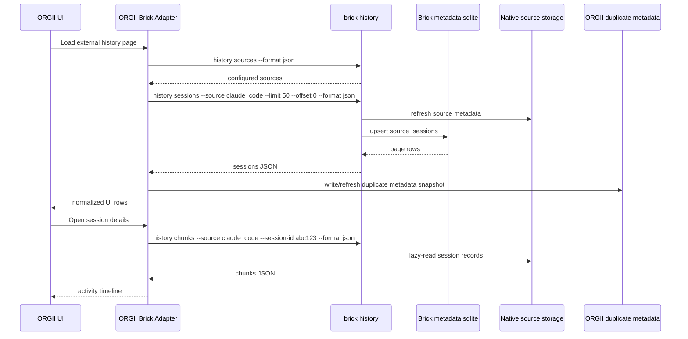

# ORGII Adapter Contract

This document defines the integration boundary for ORGII offloading external history discovery, metadata indexing, chunk formatting, plan relationship recovery, and audit export to Brick. It is an adapter contract, not a UI specification. ORGII should keep its app/runtime responsibilities and call Brick for portable external-history reads.

Related documents:

- `architecture.md` defines the source metadata index architecture and ownership boundary.
- `source-querying.md` defines provider-specific native storage, parser, and chunk-formatting details.
- `session-metadata.md` defines `metadata.sqlite`, `source_sessions`, `source_plans`, and export schemas.
- `orgtrack-core-offload.md` inventories which ORGII `orgtrack-core` responsibilities move into Brick.

## Goals

1. Make Brick the owner of external history source discovery, metadata refresh, lazy chunk loading, plan/session edge recovery, and export formatting.
2. Keep ORGII as a thin consumer/adapter over Brick for external history, while ORGII continues to own UI, live runtime sessions, app state, and migration safety checks.
3. Preserve ORGII local duplicate metadata during migration as a safety net for rollback, compare mode, and user trust.
4. Keep full transcript bytes out of Brick's source metadata index by default. Brick should read native source storage lazily and copy full evidence only through explicit evidence actions.

## Terminology

| Term | Meaning |
| --- | --- |
| External history | Native history produced by Cursor IDE, Claude Code, Codex App, OpenCode, Windsurf, or similar tools outside ORGII runtime ownership. |
| ORGII adapter | ORGII-side module that invokes Brick commands, parses JSON, enforces timeouts, runs dual-read comparison, and falls back when needed. |
| Source metadata index | Brick's global `<BRICK_HOME>/metadata.sqlite`, including `source_sessions`, `source_plans`, and `source_plan_session_edges`. |
| ORGII duplicate metadata | ORGII's local copy of external-history metadata retained during migration for fallback and parity checks. |
| Native source storage | Provider-owned files or databases, such as Claude/Codex JSONL files or Cursor-family SQLite databases. |
| Chunk | Normalized, ORGII-compatible activity record returned by Brick from a native session on demand. |

## Command boundary

ORGII should call `brick history ...` commands as read APIs. These commands may refresh Brick's source metadata index before returning, but they must not append Brick provenance events, mutate ORGII app data, or copy transcript bytes into Brick blobs unless the user explicitly requests evidence import through a separate flow.

All command examples below assume JSON unless explicitly marked CSV. ORGII should invoke the installed Brick binary or a packaged sidecar using argument arrays, not shell-interpolated strings.

### `history sources`

Command:

```bash
brick history sources --format json
```

Purpose:

- Discover configured Brick source profiles available to this user/session.
- Let ORGII build source filters and determine whether Brick has enough configuration to serve each provider.

Current response boundary:

```json
{
  "sources": [
    {
      "source_id": "claude_code",
      "app_id": "claude_code",
      "actor_id": null,
      "actor_type": null,
      "selected": false,
      "store_root": null,
      "session_db_path": null,
      "session_log_path": "/Users/example/.claude/projects",
      "evidence_root": null,
      "cursor_state_db_path": null,
      "notes": null
    }
  ]
}
```

Adapter rules:

- Treat `source_id` as the stable key for later calls.
- Do not assume every path field is present. File-backed sources usually use `session_log_path` or `evidence_root`; DB-backed sources usually use `session_db_path` or `cursor_state_db_path`.
- Source rows are configuration/discovery records, not proof that any sessions exist.

### `history sessions`

Command:

```bash
brick history sessions --source <source_id> --limit <n> --offset <n> --format json
```

Purpose:

- Refresh metadata for one source and return a paginated list of session rows from the source metadata index.
- Replace ORGII's source-specific session listing code after parity.

Current response boundary:

```json
{
  "source_id": "claude_code",
  "limit": 20,
  "offset": 0,
  "total": 42,
  "has_more": true,
  "sessions": [
    {
      "source_id": "claude_code",
      "app_id": "claude_code",
      "session_id": "claude_code:abc123",
      "external_session_id": "abc123",
      "title": "Investigate parser issue",
      "path": "/Users/example/.claude/projects/repo/abc123.jsonl",
      "size_bytes": 12345,
      "modified_at": "2026-06-18T10:00:00Z",
      "created_at": "2026-06-18T09:15:00Z",
      "updated_at": "2026-06-18T10:00:00Z",
      "model": "claude-example",
      "input_tokens": 1000,
      "output_tokens": 500,
      "total_tokens": 1500,
      "repo_path": "/workspace/repo",
      "branch": "feature/example",
      "files_changed": 2,
      "lines_added": 30,
      "lines_removed": 4,
      "touched_files": ["src/lib.rs"]
    }
  ]
}
```

Adapter rules:

- Use `external_session_id` plus `source_id` as the durable native identity.
- Treat `session_id` as Brick/consumer-visible compatibility ID. ORGII may keep its own prefixed IDs during migration, but should store the Brick pair `(source_id, external_session_id)` to avoid ambiguity.
- Sort order is owned by Brick. ORGII may apply UI grouping/filtering after receipt, but should not re-scan native storage to correct Brick ordering except in compare mode.
- Use `has_more` and `offset + sessions.length` for pagination. Do not infer completeness from `sessions.length < limit` alone.
- Treat token, model, repo, branch, and impact fields as nullable. `null` means unknown, not zero.

### `history recent-paths`

Command:

```bash
brick history recent-paths --source <source_id|all> --limit <n> --format json
```

Purpose:

- Return recent session source paths for quick-open, spotlight, or "recent external activity" UI.
- Replace ORGII's per-source recent-path aggregation once parity is acceptable.

Current response boundary:

```json
{
  "source_id": "all",
  "limit": 20,
  "paths": [
    {
      "source_id": "claude_code",
      "app_id": "claude_code",
      "session_id": "claude_code:abc123",
      "path": "/Users/example/.claude/projects/repo/abc123.jsonl",
      "title": "Investigate parser issue",
      "size_bytes": 12345,
      "modified_at": "2026-06-18T10:00:00Z"
    }
  ]
}
```

Adapter rules:

- Use `source=all` for cross-source recent UI and a specific `source_id` for source-scoped panels.
- Treat paths as evidence pointers. ORGII should not open or parse them directly unless running fallback or compare mode.
- Rows are constrained to configured sources; if a source is not configured in Brick, ORGII's duplicate metadata may still contain rows during migration.

### `history chunks`

Command:

```bash
brick history chunks --source <source_id> --session-id <external_session_id_or_compatible_session_id> --format json
```

Purpose:

- Lazy-read a single native session and return normalized activity chunks.
- Replace ORGII's source-specific `ActivityChunk` loading paths.

Current response boundary:

```json
{
  "source_id": "claude_code",
  "session_id": "abc123",
  "chunks": [
    {
      "chunk_id": "abc123:1",
      "session_id": "abc123",
      "action_type": "raw",
      "function": "user_message",
      "args": { "content": "Investigate parser issue" },
      "result": null,
      "created_at": "2026-06-18T09:15:00Z",
      "source_id": "claude_code",
      "source_path": "/Users/example/.claude/projects/repo/abc123.jsonl",
      "source_line_number": 1
    }
  ]
}
```

Adapter rules:

- Call chunks only when the UI needs session detail, audit display, comparison, or export preview.
- Do not use `history chunks` for list pages. Lists should use `history sessions` or `history recent-paths`.
- Chunk order is provider-owned and should preserve native order. ORGII should not sort chunks unless displaying a filtered or derived view.
- Unknown or provider-specific chunk metadata may be added over time. ORGII should ignore unknown fields and preserve them when writing debug snapshots.
- If Brick returns metadata but no chunks for a source/session, ORGII should display a metadata-only session and use fallback only when the user explicitly opens details or compare mode requires parity.

### `history plans`

Command:

```bash
brick history plans --source <source_id> --limit <n> --offset <n> --format json
```

Purpose:

- Return source-native planning artifacts and plan/session edges recovered into Brick's source metadata index.
- First useful source is `cursor_ide`, where plan registry data can recover relationships even when full composer rows are partially unreadable.

Current response boundary:

```json
{
  "source_id": "cursor_ide",
  "limit": 20,
  "offset": 0,
  "total": 3,
  "has_more": false,
  "plans": [
    {
      "source_id": "cursor_ide",
      "plan_id": "cursor_ide:plan-1",
      "external_plan_id": "plan-1",
      "title": "Implement provider fixtures",
      "source_path": "/Users/example/.cursor/plans/plan-1.plan.md",
      "source_uri": "file:///Users/example/.cursor/plans/plan-1.plan.md",
      "source_mtime": "2026-06-18T10:00:00Z",
      "parser_version": "cursor-ide-plan-registry-v1",
      "discovered_at": "2026-06-18T10:01:00Z",
      "last_seen_at": "2026-06-18T10:01:00Z",
      "created_at": "2026-06-18T10:01:00Z",
      "updated_at": "2026-06-18T10:01:00Z",
      "metadata_json": {}
    }
  ],
  "edges": [
    {
      "source_id": "cursor_ide",
      "plan_id": "cursor_ide:plan-1",
      "external_plan_id": "plan-1",
      "external_session_id": "composer-1",
      "role": "built_by",
      "todo_ids_json": ["todo-1"],
      "discovered_at": "2026-06-18T10:01:00Z",
      "last_seen_at": "2026-06-18T10:01:00Z",
      "created_at": "2026-06-18T10:01:00Z",
      "updated_at": "2026-06-18T10:01:00Z",
      "metadata_json": null
    }
  ]
}
```

Adapter rules:

- Treat plans as source-native artifacts, not ORGII tasks. ORGII may render them or link them to UI concepts, but Brick does not assign ORGII task semantics.
- `edges[].external_session_id` is intentionally preserved even when `history sessions` cannot return a matching session row.
- Supported edge roles are currently `created_by`, `edited_by`, `referenced_by`, and `built_by`.
- If ORGII needs plan Markdown content, it should treat `source_path` as an evidence pointer and either ask Brick for a future plan-content/export command or use explicit evidence import. The `history plans` contract is metadata and edge oriented.

### `history export`

Commands:

```bash
brick history export --source <source_id> --session-id <external_session_id_or_compatible_session_id> --schema audit-v1 --format json
brick history export --source <source_id> --session-id <external_session_id_or_compatible_session_id> --schema source-metadata-v1 --format json
brick history export --source <source_id> --session-id <external_session_id_or_compatible_session_id> --schema audit-v1 --format csv
```

Purpose:

- Produce a stable single-session audit packet or metadata parity packet.
- Let ORGII use one export path for user-visible audits, bug reports, migration comparisons, and manual verification.

Response boundaries:

- `audit-v1` JSON includes `schema`, `exported_at`, `source`, `session`, `token_usage`, `impact`, `evidence`, `chunks`, and `source_metadata`.
- `source-metadata-v1` JSON includes `schema`, `exported_at`, `source_session`, and `chunks`.
- CSV is a presentation/export convenience over `audit-v1`; ORGII should not use CSV for internal data flow.

Adapter rules:

- Use `audit-v1` for user-facing evidence bundles and external review handoff.
- Use `source-metadata-v1` for parity debugging because it preserves source metadata index fields and provider extras.
- Treat JSON as canonical. CSV should be downloaded or copied by the user, not re-ingested into ORGII.

### Future `history doctor`

`history doctor` is not implemented in this branch. The adapter should reserve this command name and shape rather than invent ORGII-only diagnostics that cannot migrate.

Proposed command:

```bash
brick history doctor --source <source_id|all> --format json
```

Proposed purpose:

- Validate source configuration, native path existence, read permissions, schema compatibility, parser versions, and metadata index freshness.
- Summarize recoverable warnings separately from hard errors.

Proposed response boundary:

```json
{
  "source_id": "all",
  "status": "warning",
  "checked_at": "2026-06-18T10:00:00Z",
  "checks": [
    {
      "source_id": "cursor_ide",
      "check": "native_storage_readable",
      "status": "ok",
      "message": "Cursor state database opened read-only",
      "details": {}
    },
    {
      "source_id": "windsurf",
      "check": "configured_path_exists",
      "status": "warning",
      "message": "No Windsurf state database found at configured path",
      "details": { "path": "/Users/example/Library/Application Support/Windsurf/User/globalStorage/state.vscdb" }
    }
  ]
}
```

Adapter rules until implemented:

- If ORGII attempts `history doctor` and receives an unknown-command failure, surface diagnostics as "Brick history doctor unavailable" and fall back to `history sources` plus ORGII's existing source checks.
- Do not block normal history reads solely because `history doctor` is unavailable.
- When implemented, doctor output should feed ORGII diagnostics UI but not replace command-specific error handling.

## Read sequence



## Migration stages

ORGII should migrate source-by-source and feature-by-feature. The adapter should support stage flags at minimum by source and command family (`sessions`, `recent_paths`, `chunks`, `plans`, `export`).

| Stage | Name | ORGII behavior | Success gate | Fallback |
| --- | --- | --- | --- | --- |
| 0 | Brick unavailable | ORGII uses existing source readers and caches. Brick calls are disabled except optional diagnostics. | None. | Existing ORGII implementation. |
| 1 | Shadow read | ORGII serves UI from existing source readers, calls Brick in the background, stores result snapshots, and records parity metrics. | Brick command succeeds within timeout and response validates. | Ignore Brick result for UI. |
| 2 | Dual-read compare | ORGII calls both old reader and Brick on the request path, serves old reader by default, and surfaces compare diagnostics for mismatches. | Row count, identity, timestamps, title, token totals, impact stats, and chunk counts are within accepted tolerances. | Serve old reader. |
| 3 | Brick primary with fallback | ORGII serves Brick results by default while retaining ORGII duplicate metadata and old chunk readers for failure cases. | Source has passed compare for representative fixtures and real local samples. | Serve ORGII duplicate metadata or old reader per command. |
| 4 | Brick primary with safety duplicate | ORGII no longer runs old scans on normal path, but keeps duplicate metadata refreshed from Brick responses for rollback and UI continuity. | Operational stability over a release window. | Serve duplicate metadata for list/recent views; details may require old reader if still shipped. |
| 5 | Brick-only external history | ORGII removes old external source readers and treats Brick as the sole external-history provider. Duplicate metadata becomes optional cache or is deleted after migration policy allows. | User migration completed and support rollback window closed. | Brick error UI and exportable diagnostics. |

## Compare policy

During stages 1-3, ORGII should compare responses without requiring byte-for-byte identity.

Recommended comparisons:

- Source coverage: Brick includes every source ORGII expects, or returns a clear configuration warning.
- Session identity: compare `(source_id, external_session_id)` as the primary key.
- Timestamps: compare `created_at`, `updated_at`, and `modified_at` with provider-specific tolerance for missing values.
- Titles: compare normalized non-empty titles, allowing truncation differences.
- Tokens: compare totals when both sides expose them; treat `null` and `0` as different unless the provider is known to report zero for unknown.
- Impact stats: compare touched file sets and line/file counts when available.
- Chunks: compare count, order, action/function sequence, and source pointers; do not require exact text equality when providers intentionally normalize large blobs.
- Plans: compare `external_plan_id`, edge role, `external_session_id`, and `todo_ids_json` where applicable.

A mismatch should be recorded with command, source, external ID, parser version when known, and compact samples from both sides. It should not fail the user path until ORGII has opted that source/command into strict compare mode.

## Error behavior

The adapter boundary should classify failures before deciding fallback.

| Failure class | Examples | Adapter behavior |
| --- | --- | --- |
| Brick unavailable | Binary missing, spawn failure, incompatible executable permissions. | Mark Brick unavailable for the current session, use ORGII fallback, show setup/diagnostic action. |
| Command unavailable | `history doctor` not implemented, older Brick binary missing `plans`. | Feature-detect once, disable only that command path, use fallback where available. |
| Invalid request | Missing `source`, unknown source, missing `session-id`, unsupported format. | Treat as adapter bug; log with arguments, avoid silent fallback loops, surface developer diagnostics. |
| Source configuration error | Native path missing, source profile missing, permission denied. | Show source-specific user guidance; fallback to ORGII duplicate metadata if it has recent rows. |
| Parser/schema error | Native DB schema drift, malformed JSONL, parser panic converted to error. | For explicit detail/export requests, surface the error and offer fallback if old reader supports the source. For list views, use duplicate metadata if safe. |
| Timeout | Command exceeds adapter deadline. | Kill child process, record timeout, fallback. Increase timeout only for explicit long-running diagnostics or exports. |
| Invalid JSON | Non-JSON output, truncated output, schema validation failure. | Treat as Brick failure, preserve raw stderr/stdout sample in debug logs, fallback. |
| Partial data | Valid response with empty chunks or missing optional fields. | Display available metadata; use fallback only if current stage requires parity or user opened missing details. |

Brick should use non-zero exit codes for hard failures and machine-readable JSON on stdout for successful calls. Human-readable diagnostics may go to stderr. ORGII should parse stdout only after exit success, except for feature detection where an unknown-command failure is expected.

## Timeout policy

ORGII should enforce timeouts outside Brick so UI remains responsive. Suggested defaults:

| Command | Interactive timeout | Background timeout | Notes |
| --- | --- | --- | --- |
| `history sources` | 2s | 5s | Should be configuration-only and fast. |
| `history sessions` | 8s | 30s | May refresh metadata. Use pagination and source-scoped calls. |
| `history recent-paths` | 5s | 15s | Should query the metadata index after refresh. |
| `history chunks` | 10s | 45s | Lazy session read can parse larger files or DB rows. |
| `history plans` | 8s | 30s | Cursor plan registry reads should be bounded. |
| `history export --format json` | 15s | 60s | Includes chunks and metadata. |
| `history export --format csv` | 15s | 60s | User-initiated export path. |
| Future `history doctor` | 10s | 60s | Diagnostics may perform deeper checks. |

Timeout rules:

1. Use shorter interactive deadlines for UI paint and longer background deadlines for shadow/compare jobs.
2. Kill timed-out child processes and discard partial stdout.
3. Mark a source as temporarily degraded after repeated timeouts, with exponential backoff for background shadow calls.
4. Do not run unbounded cross-source refreshes on the foreground path. Prefer source-scoped calls and `source=all` only for lightweight recent-path views.

## What remains in ORGII

ORGII continues to own:

- Product UI rendering, navigation, filters, search interactions, spotlight behavior, and frontend state.
- Tauri command registration and platform app plumbing.
- Live ORGII runtime sessions, active agent orchestration, automation, and in-progress session state.
- ORGII-specific task, project, memory, analysis, and scheduling policies.
- Migration feature flags, dual-read comparison, fallback routing, and local duplicate metadata retention.
- User messaging when Brick is unavailable, unconfigured, or out of date.
- Optional mapping from Brick external-history DTOs to ORGII UI DTOs.

ORGII should not own long-term:

- External source discovery logic for Cursor, Claude Code, Codex App, OpenCode, Windsurf, or similar native history sources.
- Native source parser implementations for external history.
- Source metadata invalidation, parser versioning, or source fingerprinting.
- Lazy formatting of source records into generic activity chunks.
- Cross-provider audit JSON/CSV export formatting.
- Source diagnostics once `history doctor` exists.

## What remains in Brick

Brick owns:

- Source profile discovery and source configuration surfaces.
- Read-through metadata refresh for external history sources.
- `<BRICK_HOME>/metadata.sqlite` as the source metadata index.
- `source_sessions`, `source_plans`, and `source_plan_session_edges` schema and migrations.
- Provider parser versions, source fingerprints, and invalidation semantics.
- Lazy source chunk providers and source-record pointers.
- Cross-provider `audit-v1` and `source-metadata-v1` export schemas.
- Future source/history diagnostics.

Brick does not own ORGII runtime internals or UI state. ORGII-origin live sessions should enter Brick only through explicit provenance events or evidence import/export paths.

## Source metadata index policy

Brick's source metadata index is the durable query index for external history metadata. It is not a transcript cache and not an ORGII app database.

Required index semantics for ORGII integration:

1. `source_sessions` stores one row per `(source_id, external_session_id)` with source path/URI, source mtime/size/fingerprint, parser version, session timestamps, model, token totals, repo context, impact stats, touched files, listability, lifecycle timestamps, and provider `metadata_json`.
2. `source_plans` stores source-native plan rows keyed by `(source_id, external_plan_id)`.
3. `source_plan_session_edges` stores plan/session relationships without requiring a matching `source_sessions` row.
4. Full transcript content remains in native storage by default. Chunk commands lazy-read native records and may include source pointers.
5. Explicit evidence copy/upload should go through Brick provenance events and content-addressed blobs, not through `metadata.sqlite`.
6. Provider extras should stay under `metadata_json` until they become stable cross-provider fields.
7. Parser/version changes should be reflected in row fingerprints or parser metadata so ORGII compare mode can explain differences.

## ORGII duplicate metadata safety policy

ORGII should retain local duplicate metadata during migration even though Brick is the target owner. This duplicate is a safety net, not a competing source of truth.

Policy:

- Store enough Brick response metadata to render list and recent-path views without immediately re-reading native source storage.
- Key duplicates by `(source_id, external_session_id)` and include the Brick `session_id` when present.
- Record `brick_binary_version` or detected build identifier when available, command name, command arguments, response schema version when available, fetched timestamp, and parser version fields when returned.
- Keep previous ORGII metadata fields needed by existing UI during stages 0-4.
- Mark duplicate rows with origin: `orgii_reader`, `brick_shadow`, `brick_primary`, or `brick_fallback_snapshot`.
- Never treat duplicate metadata as proof that full chunks are available. Chunk availability is checked by `history chunks` or export commands.
- Prefer Brick primary data in stage 3+, but use duplicate metadata when Brick is unavailable, timed out, or returns a source configuration error and the duplicate row is recent enough for the UI.
- Expire or compact duplicate rows only after a source has reached Brick-only stage and rollback policy permits deletion.
- Keep user privacy expectations unchanged: do not copy full transcripts into ORGII duplicate metadata unless ORGII already did so before migration and the user has consented to that behavior.

Recommended duplicate freshness windows:

| View | Suggested maximum age | Fallback treatment |
| --- | --- | --- |
| Recent external history list | 24h | Show stale badge and retry Brick in background. |
| Source detail list | 7d | Show stale source warning if Brick cannot refresh. |
| Open session details | Metadata only until chunks load | Ask Brick first; old reader fallback only in stages 0-3. |
| Audit export | No stale fallback by default | Require live Brick export or explicit old-reader export path. |

## Adapter implementation notes

- Use a typed command runner that accepts `Vec<String>`/argument arrays and captures stdout, stderr, exit status, duration, and timeout state.
- Validate JSON responses into versioned ORGII adapter DTOs. Unknown fields should be ignored but preserved in debug snapshots when feasible.
- Keep source feature flags separate: a source can use Brick for `sessions` while still using ORGII for `chunks` until chunk parity is proven.
- Cache negative feature detection for the current process, especially future commands such as `history doctor`.
- Use small pages for interactive views and background prefetch only after the first page succeeds.
- Avoid concurrent refresh storms. For the same `(command, source)` pair, coalesce requests or let one foreground request update duplicate metadata for waiting callers.
- Keep stdout JSON and stderr diagnostics separate in logs.

## Open questions for ORGII implementation

1. Which Brick binary/version discovery command should ORGII use for compatibility gating? If none exists yet, should Brick add a machine-readable `--version --format json` or `doctor` field?
2. Should ORGII pass Brick `external_session_id` or Brick `session_id` to `history chunks` and `history export` after cutover, and should Brick formally accept both?
3. What mismatch tolerances should be source-specific for timestamps, titles, token totals, impact stats, and chunk text normalization?
4. How long should ORGII retain duplicate metadata after each source reaches Brick-primary or Brick-only status?
5. Does ORGII need a Brick library/RPC integration for lower latency, or is process invocation sufficient for the migration window?
6. Should plan Markdown content receive a dedicated Brick command, or should ORGII treat plan paths as evidence pointers until explicit import?
7. What user-facing recovery action should ORGII show when Brick cannot access a native source that ORGII's old reader can still read?
